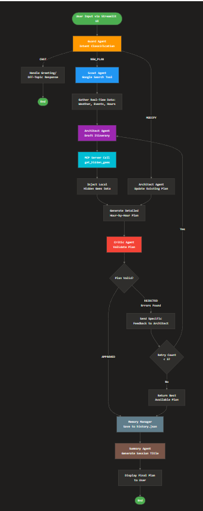

# The Istanbul Insider 🇹🇷

### Google AI Agents Capstone Project

**Track:** Concierge Agents
**Author:** Mohamed Hadri
**Live Demo:** [Launch App 🚀](https://app-ai-agents-capstone-project.streamlit.app/)

[](https://app-ai-agents-capstone-project.streamlit.app/)

## Overview

"The Istanbul Insider" is a multi-agent travel orchestrator that goes beyond simple itinerary generation. It features a **Self-Correcting Loop** where a "Critic Agent" validates plans against real-world logic, and a **Local MCP Server** that injects private "Hidden Gem" knowledge that standard LLMs might miss.


## Key Features (Course Concepts Applied)

1.  **Multi-Agent System**:
    - **Scout**: Gathers raw information.
    - **Architect**: Plans the itinerary.
    - **Critic**: Validates the plan (Loop Agent).
    - **Guard**: Filters off-topic requests and handles greetings.
2.  **Tools & MCP**:
    - **Custom MCP Server**: A local FastAPI server providing "Hidden Gems" data.
    - **Search Tool**: For real-time info.
3.  **Sessions & Memory**:
    - Agents maintain history context throughout the planning loop.
    - The system remembers the current plan for iterative improvements.

## Setup & Run

1.  **Install Dependencies**:

    ```bash
    pip install -r requirements.txt
    ```

2.  **Configure API Key**:
    - Create a `.env` file in the root directory.
    - Add your Gemini API key:
      ```
      GOOGLE_API_KEY=your_api_key_here
      ```

3.  **Run the Agent**:
    ```bash
    streamlit run app.py
    ```

## System Architecture & Flow

The system follows a **Hub-and-Spoke** architecture with a **Self-Correcting Planning Loop**.

### 1. Input Processing & Routing

- **User** enters a request via the **Streamlit UI**.
- **Guard Agent** intercepts every message to classify intent:
  - `CHAT`: Handles greetings and off-topic questions directly.
  - `NEW_PLAN`: Triggers the full planning sequence.
  - `MODIFY`: Triggers a plan update using existing context.

### 2. The Planning Loop (Orchestration)

If the Guard detects a planning intent, the **Streamlit Orchestrator** (`app.py`) initiates the agent workflow:

1.  **Scout Phase** (Only for `NEW_PLAN`):
    - **Scout Agent** uses `google_search` to gather real-time data (weather, opening hours, events).
    - This raw context is passed to the Architect.

2.  **Architect Phase**:
    - **Architect Agent** drafts a detailed itinerary.
    - **Tool Usage**: Calls the **MCP Server** (via `get_hidden_gems`) to inject unique local recommendations that aren't in the standard training data.

3.  **Critic Phase (Verification Loop)**:
    - **Critic Agent** reviews the Architect's draft for logical errors (e.g., impossible travel times, closed venues).
    - **Feedback**: If rejected, the Critic sends specific feedback back to the Architect.
    - **Retry**: The Architect revises the plan. This loop repeats up to 3 times or until approved.

### 3. Memory & State Management

- **Memory Manager**: Persists chat history and session metadata to `data/history.json`.
- **Summary Agent**: Asynchronously generates concise titles for new sessions.
- **State**: The `current_plan` is stored in the session state, allowing the user to ask for modifications ("Make it 3 days instead") without restarting the process.

### 4. Tooling Layer

- **MCP Server**: A standalone FastAPI service (`tools/mcp_server.py`) running on port 8000. It serves structured data from `data/hidden_gems.json`.
- **Google Search**: Used by Scout and Critic for ground-truthing.

## Visual Workflow

The following flowchart illustrates the end-to-end process, from the user's initial request to the final validated itinerary. It highlights the interaction between the **Guard**, **Scout**, **Architect**, and **Critic** agents, as well as the integration of the **MCP Server** for local knowledge.



## 🌟 Give it a Star

If you found this project interesting or helpful, please consider giving it a star on GitHub! It helps others discover the project and motivates me to keep improving it.

[](https://github.com/mohamedhadri/capstone-2)
